# 🛡️ SANKALP — Defence Ontology Platform

> **संकल्प** (Sankalp) — *"A solemn resolve"*  
> "Ontology as Digital Twin" for Indian Defence (DRDO / IAF / Army / Navy).

[](https://python.org)
[](https://neo4j.com)
[](https://streamlit.io)
[](https://groq.com)
[](LICENSE)

---

## 🧠 Architecture — 5 Core Agents

| Agent | Sanskrit Name | Role |
|-------|--------------|------|
| Ingestion | **Ganana** (गणना) | Reads CSVs → SQLite raw store |
| Transformation | **Shodhan** (शोधन) | Cleans & enriches → Gold tables |
| Ontology | **Bandhan** (बंधन) | Builds Neo4j knowledge graph |
| ML Readiness | **Bhavishyavani** (भविष्यवाणी) | Computes AI readiness scores |
| Dashboard | **Darshan** (दर्शन) | Streamlit command interface |

---

## 🏗️ System Architecture



The platform is built on a layered, event-driven pipeline:

- **Data Sources** — Three parallel branches (IAF, Army, Navy), each supplying CSVs
- **Ganana** — Per-branch ingestion agents writing to SQLite raw stores
- **Shodhan** — Transformation agents producing Gold-quality tables
- **Bandhan** — Shared ontology agent merging all three branches into the Neo4j knowledge graph
- **Neo4j** — Central graph store holding `:Aircraft`, `:ArmyAsset`, `:Vessel`, crew, missions, sorties, and all relationships
- **Bhavishyavani** — ML readiness scoring, writing `final_readiness_score` back to Neo4j
- **Ontology Engine** — Doctrine rule evaluation + Groq LLM (Llama 3.1) + FAISS RAG layer
- **Readiness Monitor** — Background polling thread writing to the Alerts SQLite DB
- **Darshan** — Streamlit dashboard surfacing everything across all branches

---

## 🚀 Quick Start

### 1. Clone & Setup
```bash
git clone https://github.com/<your-org>/sankalp.git
cd sankalp
cp .env.example .env          # Fill in GROQ_API_KEY and NEO4J_PASSWORD
pip install -r requirements.txt

# Create the Neo4j import directory before Docker (ensures correct ownership)
mkdir -p data/neo4j_import
```

### 2. Start Neo4j (Docker)
```bash
docker compose up -d
```

| Service | URL |
|---------|-----|
| Neo4j Browser | http://localhost:7474 |
| Streamlit Dashboard | http://localhost:8501 |

### 3. Run the Orchestrator (without Docker)
```bash
python sankalp_orchestrator.py
```
This runs all five agents in sequence and then launches the Darshan dashboard.

### 4. Offline / Demo Mode
If Neo4j is unreachable, Bandhan and Bhavishyavani log warnings and continue.  
All agents fall back gracefully to reading/writing from the Gold SQLite stores.

---

## ⚙️ Configuration

All runtime parameters are managed from a single source of truth: **`config.yml`**.  
The `config_loader.py` helper provides dot-path access to any setting at runtime.  
Environment variables override any value in `config.yml`.

Key configuration sections:

| Section | Purpose |
|---------|---------|
| `neo4j` | URI, credentials, retry/backoff settings |
| `streamlit` | Port, layout, cache TTL |
| `paths` | All DB file paths and directory locations |
| `readiness` | Operational, warning & critical score thresholds |
| `llm` | Groq model, token budgets, RAG top-k |
| `alerts` | Monitor poll interval, dashboard refresh rate, log limits |
| `ui_limits` | Fuel/ammo number input bounds per branch |
| `neo4j_schema` | Valid node labels and relationships for Cypher tools |

### Key Environment Variables (`.env`)

| Variable | Description |
|----------|-------------|
| `GROQ_API_KEY` | Groq API key for LLM inference |
| `NEO4J_PASSWORD` | Neo4j database password |
| `NEO4J_URI` | Bolt URI (default: `bolt://localhost:7687`) |
| `MODEL` | Override LLM model (default: `llama-3.1-8b-instant`) |

---

## 🔔 Live Alerts — Readiness Monitor

The Live Alerts system is an event-driven readiness monitor running as a **background daemon thread** alongside the orchestrator. It continuously polls the Neo4j knowledge graph, evaluates all defined doctrine rules, and automatically records alerts whenever operational tiers change.

### How It Works

A background thread (`readiness_monitor.py`) wakes on a configurable interval (`alerts.monitor_poll_secs` in `config.yml`, default `60s`), queries Neo4j for the latest readiness scores across all three branches, and runs `evaluate_action()` against every doctrine rule. If a rule's tier shifts — e.g., from `ADEQUATE` to `INSUFFICIENT` because too many aircraft dropped below the operational threshold — the monitor writes an alert record to `data/processed/sankalp_alerts.db` with the direction of change, branch counts, and a human-readable message.

```
Neo4j (live graph)
      ↓  polls every 60s (config: alerts.monitor_poll_secs)
readiness_monitor.py  (background daemon thread)
      ↓  on tier change
sankalp_alerts.db  (SQLite — alerts + fleet_snapshots tables)
      ↓  reads
Darshan → 🔔 Live Alerts panel  (Streamlit, auto-refreshes every 30s)
```

### Alert Tiers

| Tier | Meaning |
|------|---------|
| 🏆 SUPERIOR | All branch requirements met and enhancement thresholds exceeded |
| 🟡 ADEQUATE | Minimum requirements met; action is executable |
| 🔴 INSUFFICIENT | One or more branch minimums not met; action cannot be executed |

A transition from a higher tier to a lower one is recorded as `degraded`; the reverse is `improved`.

### Viewing Alerts

Navigate to **🔔 Live Alerts** in the Darshan sidebar. The panel shows:

- A **fleet readiness timeline** — line chart of average readiness % per branch over time (IAF, Army, Navy)
- An **operational count timeline** — how many assets are in `Operational` status per branch
- A **scrollable event log** of all tier changes, colour-coded by direction, with branch counts at the time of each event

Toggle "Show acknowledged" to include older read alerts, or mark all unread as acknowledged with a single click.

### Configuration

| Config Key | Default | Description |
|------------|---------|-------------|
| `alerts.monitor_poll_secs` | `60` | Background thread polling interval (seconds) |
| `alerts.dashboard_refresh_secs` | `30` | Darshan panel auto-refresh interval (seconds) |
| `alerts.snapshot_limit` | `120` | Max fleet snapshots fetched for timeline chart |
| `alerts.alert_log_limit` | `50` | Max alert events shown in the event log |
| `readiness.operational_threshold` | `5` | Base score threshold for `Operational` status |

---

## 🔭 Advanced Modules

### 1. MCP Server (Model Context Protocol)

| File | Transport | Description |
|------|-----------|-------------|
| `mcp_server.py` | stdio | For Claude Desktop. Exposes 6 tools: fleet readiness, critical assets, doctrine evaluation, mission history, top assets, and rule listing. Reads from SQLite gold stores — no Neo4j dependency. |
| `mcp_server_http.py` | SSE / HTTP | URL-based MCP connector. Run with `uvicorn mcp_server_http:app --port 8080`. |

MCP config is defined in `mcp_config.json`.

To connect Claude Desktop to the MCP server, edit mcp_config.json — replace /ABSOLUTE/PATH/TO/sankalp with your real path, then copy the mcpServers block into:

Mac/Linux: ~/.config/claude/claude_desktop_config.json
Windows: %APPDATA%\Claude\claude_desktop_config.json

### 2. Threat Intelligence Engine

| File | Description |
|------|-------------|
| `agents/threat_engine.py` | `ThreatEngine` class with 6 pre-loaded scenarios: Two-Front War, Northern Infiltration, Western Border Strike, Southern Sea Threat, Hybrid, and Andaman Dispute. Each produces a `ThreatAssessment` with verdict, coverage %, gap analysis, risks, and recommendations. Fully extensible via `engine.add_scenario()`. |
| `agents/darshan_threat_tab.py` | Streamlit UI with 3 sub-tabs: all-scenarios overview with coverage bars, single-scenario deep-dive with branch metrics, and a custom scenario builder. |

### 3. Mission Planning Agent (Yojana)

| File | Description |
|------|-------------|
| `agents/yojana.py` | `MissionPlanner` scores assets on readiness + type suitability and crew on rank seniority + qualification match, then pairs them greedily. Supports all 3 branches and 20+ mission types. |
| `agents/darshan_yojana_tab.py` | Streamlit UI showing ranked plan cards with confidence badges, readiness bars, rationale, warnings, and a comparison table. The "Go to Mission Log" button routes directly to the log tab. |

### 4. Geospatial Map

| File | Description |
|------|-------------|
| `agents/darshan_geo_map.py` | Folium map centred on India with GPS coordinates for all 25 known squadrons/units/flotillas. Assets are colour-coded by readiness (green/amber/red) and branch-outlined. Includes threat zone overlays on northern, western, and southern borders. Filters by branch and status. |

### 5. Automation Engine

| File | Description |
|------|-------------|
| `agents/automation_engine.py` | Automated action scheduling & execution, persisted to `data/processed/sankalp_automation.db`. |
| `agents/darshan_automation_tab.py` | Streamlit UI for reviewing and triggering automated actions. |

### 6. Ontology Engine (AI Query Interface)

| File | Description |
|------|-------------|
| `agents/ontology_engine.py` | Natural Language → Cypher LLM engine using Groq tool-calling. |
| `agents/ontology_tools.py` | Cypher execution tools registered with the LLM. |
| `agents/ontology_rag.py` | FAISS-based RAG pipeline over ontology rules (`sentence-transformers`). |
| `agents/ontology_rules.json` | Default rule definitions (seeded to `data/processed/` on first run). |

---

## 🔭 Sample Ontology Query (Neo4j Cypher)

```cypher
// Asset lineage: which crew flew which aircraft on which mission?
MATCH (c:Crew)-[:PARTICIPATED_IN]->(m:Mission)<-[:EXECUTED]-(a:Aircraft)
RETURN a.aircraft_id, a.type, c.name, c.rank, m.mission_type, m.date
ORDER BY m.date DESC
```

---

## 📁 Project Structure

```
sankalp-ontology-platform/
│
├── sankalp_orchestrator.py         # Master orchestrator — runs all agents then launches dashboard
├── config.yml                      # Central configuration (ports, paths, thresholds, LLM settings)
├── config_loader.py                # cfg() helper — reads config.yml with dot-path access
├── mcp_server.py                   # MCP stdio server (Claude Desktop)
├── mcp_server_http.py              # MCP HTTP/SSE server (uvicorn)
├── mcp_config.json                 # MCP tool configuration
│
├── agents/                         # All pipeline & UI agents
│   │
│   ├── ── Ingestion (Ganana)
│   ├── ganana.py                   # IAF raw data ingestion (CSV → SQLite)
│   ├── ganana_army.py              # Army raw data ingestion
│   ├── ganana_navy.py              # Navy raw data ingestion
│   │
│   ├── ── Transformation (Shodhan)
│   ├── shodhan.py                  # IAF data cleansing & gold table build
│   ├── shodhan_army.py             # Army transformation
│   ├── shodhan_navy.py             # Navy transformation
│   │
│   ├── ── Ontology Graph (Bandhan)
│   ├── bandhan.py                  # IAF → Neo4j knowledge graph builder
│   ├── bandhan_army.py             # Army → Neo4j graph builder
│   ├── bandhan_navy.py             # Navy → Neo4j graph builder
│   │
│   ├── ── ML Readiness (Bhavishyavani)
│   ├── bhavishyavani.py            # AI readiness score computation (IAF)
│   │
│   ├── ── AI / Ontology Engine
│   ├── ontology_engine.py          # NL → Cypher LLM engine (Groq + tool calling)
│   ├── ontology_tools.py           # Cypher execution tools for LLM
│   ├── ontology_rag.py             # RAG pipeline over ontology rules (FAISS)
│   ├── ontology_rules.json         # Default rule definitions (seeded to data/processed/)
│   │
│   ├── ── Event-Driven Monitor
│   ├── readiness_monitor.py        # Background thread — polls Neo4j, writes alerts DB
│   ├── automation_engine.py        # Automated action scheduling & execution
│   │
│   ├── ── Advanced Modules
│   ├── threat_engine.py            # Threat Intelligence Engine (6 scenarios)
│   ├── yojana.py                   # Mission Planning Agent
│   ├── darshan_geo_map.py          # Geospatial Folium map (25 locations)
│   │
│   ├── ── Dashboard (Darshan — Streamlit)
│   ├── darshan.py                  # Main Streamlit entry point & page config
│   ├── darshan_left_sidebar.py     # Sidebar navigation & branch selector
│   ├── darshan_db_helper.py        # Shared DB/Neo4j data loaders & score utilities
│   ├── darshan_branch_renders.py   # Reusable metric cards & readiness chart components
│   ├── darshan_iaf_branch.py       # IAF branch tab renderer
│   ├── darshan_army_branch.py      # Army branch tab renderer
│   ├── darshan_navy_branch.py      # Navy branch tab renderer
│   ├── darshan_alerts_panel.py     # Live alerts panel (reads alerts DB)
│   ├── darshan_automation_tab.py   # Automation controls tab
│   ├── darshan_threat_tab.py       # Threat Intelligence UI tab
│   ├── darshan_yojana_tab.py       # Mission Planning UI tab
│   ├── darshan_chat_patch.py       # Ontology Engine chat panel patch
│   ├── render_ontology_engine_patch.py  # Ontology engine rendering helpers
│   ├── admin_import.py             # Admin: manual CSV import via dashboard
│   │
│   ├── assets/
│   │   └── styles/
│   │       └── style.css           # Global Streamlit CSS theme
│   │
│   └── __init__.py
│
├── data/
│   ├── raw/                        # Source CSV files (input data)
│   │   ├── aircraft.csv
│   │   ├── crew.csv
│   │   ├── missions.csv
│   │   ├── squadrons.csv
│   │   ├── maintenance_logs.csv
│   │   ├── army_assets.csv
│   │   ├── army_crew.csv
│   │   ├── army_ops.csv
│   │   ├── navy_vessels.csv
│   │   ├── navy_crew.csv
│   │   └── navy_sorties.csv
│   │
│   ├── processed/                  # Auto-generated at runtime (gitignored)
│   │   ├── sankalp_raw.db          # IAF raw SQLite store
│   │   ├── sankalp_gold.db         # IAF gold SQLite store
│   │   ├── sankalp_army_raw.db
│   │   ├── sankalp_army_gold.db
│   │   ├── sankalp_navy_raw.db
│   │   ├── sankalp_navy_gold.db
│   │   ├── sankalp_alerts.db       # Live readiness alerts
│   │   ├── sankalp_automation.db   # Automation task store
│   │   ├── ontology_rules.json     # Active rules (seeded from agents/ontology_rules.json)
│   │   ├── ontology_rag.index      # FAISS vector index for RAG
│   │   └── ontology_rag_meta.json  # RAG metadata (chunk → rule mapping)
│   │
│   └── neo4j_import/               # Bind-mounted into Neo4j container for bulk import
│
├── docs/
│   ├── sankalp_architecture.svg              # System architecture diagram
│   ├── palantir_vs_sankalp_gap_analysis.svg  # Gap analysis vs Palantir
│   └── todo.md                               # Development task tracker
│
├── tests/
│   └── test_automation_engine.py   # Unit tests for automation engine
│
├── .env                            # Secrets & env vars (never committed — see env.example)
├── .env.example                    # Template for .env
├── .dockerignore
├── .gitignore
├── Dockerfile                      # Python 3.11-slim image
├── docker-compose.yml              # Neo4j + agents services (uses env_file: .env)
├── requirements.txt                # Core Python dependencies
├── requirements-add.txt            # Additional/supplementary dependencies
├── setup.sh                        # One-shot local setup script
├── data-init.sh                    # Initialise data directories
├── data-migrate.py                 # DB migration utility
├── fix-neo4j.py                    # Neo4j connection diagnostics & fix helper
├── neo4j-setup.sh                  # Neo4j APOC & config bootstrap script
├── automation_integration_patch.py # Patch script for automation integration
├── integration_patch.py            # Integration patch helper
├── update_ontology_patch.py        # Patch script for ontology rule updates
├── test_altair.py                  # Quick Altair chart smoke test
├── SETUP.md                        # Detailed setup & deployment guide
├── SKILL.md                        # Agent skill / capability reference
├── LICENSE                         # MIT License
└── README.md                       # This file
```

---

## 🗺️ Roadmap

| Phase | Status | Feature |
|-------|--------|---------|
| MVP | ✅ Done | 5-agent pipeline, Streamlit UI, Neo4j ontology |
| v0.5 | ✅ Done | Config-driven architecture (`config.yml`) |
| v0.6 | ✅ Done | Groq LLM + FAISS RAG Ontology Engine |
| v0.7 | ✅ Done | Live Alerts & Readiness Monitor |
| v0.8 | ✅ Done | Threat Intelligence Engine (6 scenarios) |
| v0.9 | ✅ Done | Mission Planning Agent (Yojana) |
| v0.10 | ✅ Done | Geospatial Map (Folium — 25 locations) |
| v0.11 | ✅ Done | MCP Server (stdio + HTTP/SSE) |
| v1.0 | 🔜 Planned | Auth (Keycloak), role-based access (Officer / Admin) |
| v1.1 | 🔜 Planned | Airbyte connectors for live defence data sources |
| v2.0 | 🔜 Planned | Graph Data Science (community detection, path analysis) |
| v3.0 | 🔜 Planned | Multi-branch deployment (Army / Navy / IAF namespaces) |

---

## 🤝 Contributing

PRs welcome. Add agents under `agents/`, follow the naming convention (`<sanskrit_name>.py`).  
For new dashboard tabs, add a `darshan_<feature>_tab.py` and register it in `darshan.py`.

---

## 📜 License

MIT — Open source for national defence innovation. 🇮🇳
