Let me analyze your current Sankalp ontology engine against Palantir Foundry's Ontology System.Now I have a clear picture. Let me do a deep gap analysis between your current Sankalp implementation and the Palantir Ontology System's four pillars.Here's the gap analysis. Your Sankalp engine covers roughly **40-50% of what Palantir's Ontology System does**. Let me break it down precisely.Here's the full picture and what you should build next.

**What you already have (strong foundation):**

Your Sankalp covers Palantir's Data pillar reasonably well — CSV ingestion, SQLite gold tables, Neo4j graph with nodes/links across three branches. The Logic pillar has a good start: Bhavishyavani's readiness scoring, Groq LLM with RAG over doctrine rules, and the `evaluate_action` engine. The Action pillar has basic write-back (log mission → Neo4j). This is genuinely the hardest part of Palantir's system to replicate and you have the skeleton.

**The three gaps you should close now, in priority order:**

**1. Event-driven automations (Logic pillar — highest value)** — this is what makes the ontology "live." When `final_readiness_score` drops below the operational threshold, Sankalp should automatically fire an alert, create a maintenance task node, or notify via a webhook. You can implement this with a lightweight scheduler (APScheduler) polling Neo4j every N minutes and running `evaluate_action` checks. Add an `AutomationRule` node type with `trigger_condition`, `action_type`, and `cooldown_minutes` properties. This gets you closest to Palantir's "continuous learning loops."

**2. Logic versioning and audit trail (Logic pillar)** — currently `save_rules()` overwrites JSON with no history. Add a `RuleChangeLog` SQLite table with `(timestamp, action_name, changed_by, old_value, new_value)`. Wrap every `save_rules()` call to write to this log first. This is critical for defence use cases — DRDO will need to know who changed a doctrine rule and when. Right now it is a single admin system so log not required in MVP.

**3. Role-based access control (Security pillar — the entirely missing piece)** — Palantir calls this the most complex part because permissions must be evaluated at query time across both humans and AI agents. For Sankalp, a pragmatic MVP would be Streamlit session state + a `users` table in SQLite with `(user_id, branch_access, can_write, is_admin)`. Gate `render_iaf()`, `render_army()`, `render_navy()` behind branch-level checks, and gate all write actions (log mission, import CSV) behind `can_write`. This isn't row-level security but it gets you to "role-based branch isolation" which is the defence-relevant version. Currently not required for single admin system.

**What you're not missing (by design):** Real-time CDC and streaming ingestion, atomic multi-step transactions, and writeback to external ERP systems are enterprise infrastructure concerns. For an open-source DRDO-flavoured MVP, these are out of scope — your batch pipeline (Ganana → Shodhan → Bandhan) is the right architecture at this stage.

The most impactful single addition would be the **event-driven automation engine** because it transforms your ontology from a passive read system into an active decision-support system — which is exactly what Palantir means by "the ontology models decisions, not just data."